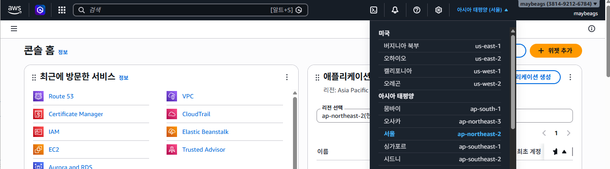
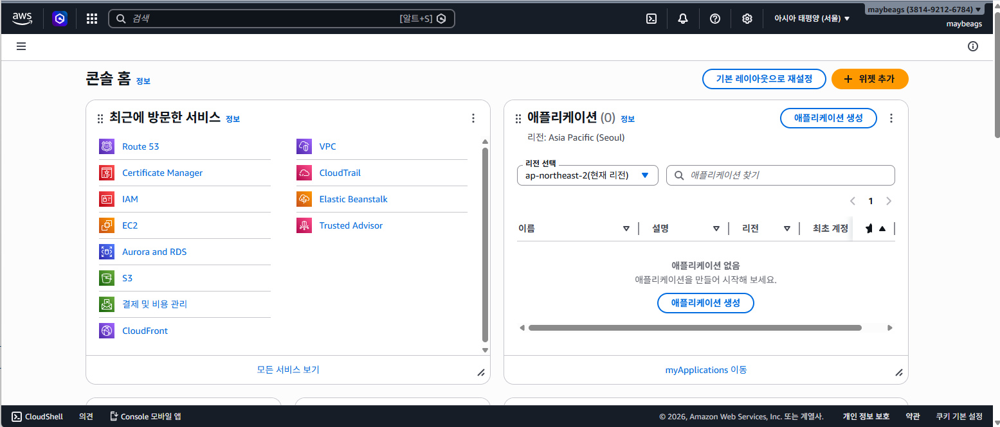
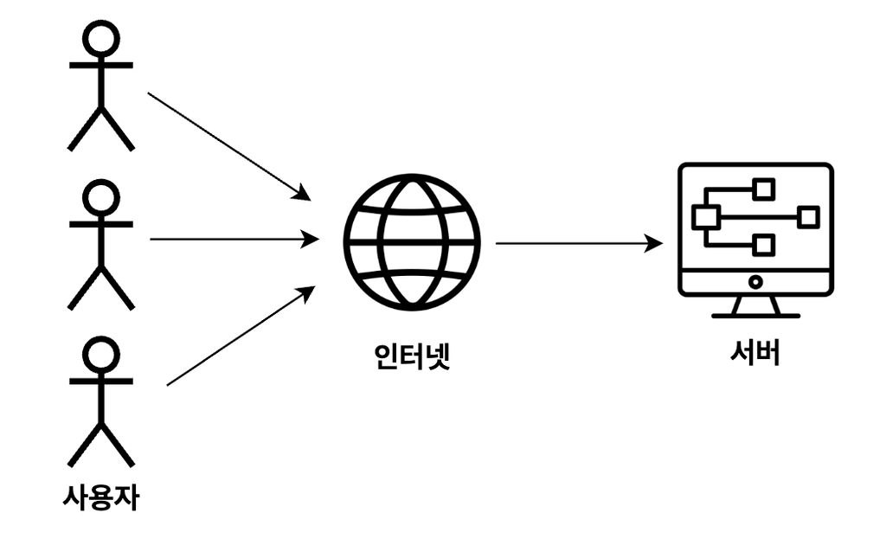
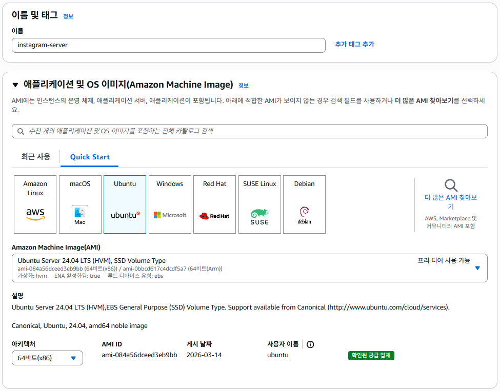
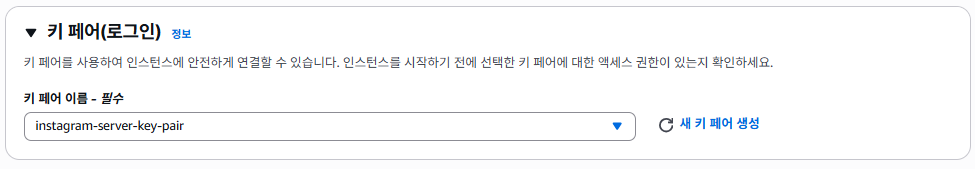
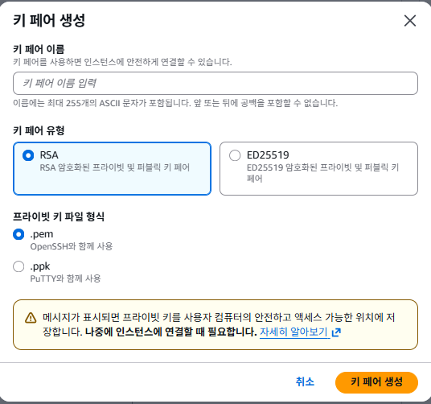
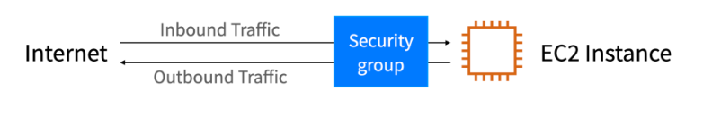
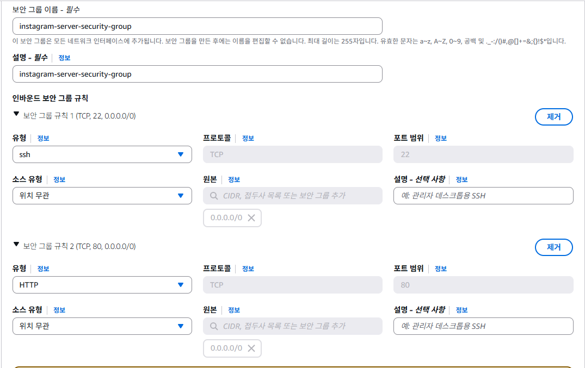

# AWS 가입 후 절차

1. 여러분영어이름폴더에 `korit_12_aws` 폴더 생성
2. learning_logs 폴더 및 20260323.md 파일 생성 후 아무 문장이나 적어놓겠습니다(파일 내에 내용이 없으면 push가 안되기 때문에)
3. https://github.com/maybeags/korit_12_aws 로 이동 후 좌측에 보이는 압축 파일들을 받아서 동일하게 세팅
4. 여러분들의 github repository 생성 및 push 작업 완료

# AWS 시작하기
## AWS 란 ?
### 클라우드 컴퓨팅(Cloud Computing)
데스크탑 컴퓨터를 사용하려면 본체 전원이 켜져있어야 할겁니다. 웹 서비스를 운영하고 있다면 서비스를 실행하고 있는 컴퓨터의 본체를 관리해야할 겁니다. 만약에 본체가 꺼지게 된다면 사용자가 웹 사이트에 접속하지 못하게 되겠네요.

이상의 문제를 해결하기 위한 개념이 클라우드 컴퓨팅입니다. 즉 서버나 스토리지, 데이터베이스 등 **컴퓨터 자원을 필요한 만큼만 원격으로 빌려서 사용할 수 있도록 하는 기술**을 의미합니다. AWS, MS Azure, GCP 등을 예로 들 수 있는데, 가장 시장 점유율이 높은 AWS를 기준으로 수업합니다.

### AWS
처음에는 그냥 웹 사이트 호스팅하는 정도로 쓰였는데 오늘날에는 DB, Storage, AI 등 다양한 서비스를 제공하고 있습니다. 즉 기업은 AWS에서 컴퓨터 자원을 빌려서 사용하고, 사용량에 따라 비용을 지불하는 형태로, 기업은 운영 비용을 줄이고, AWS 자체가 발전함에 따라 신기술을 빠르게 도입할 수 있다는 장점이 있습니다.

### 프로젝트 배포할건데 굳이 AWS 학습 따로하는 이유
1. 시장점유율 : 24년 기준 과학기술정보통신부 조사에 따르면 클라우드 서비스 이용하는 국내 기업의 60% 정도가 AWS 활용하는 것으로 나옵니다. 
2. 다양한 서비스와 통합 옵션 : 컴퓨팅, 스토리지, DB, AI, 머신러닝 등 다양한 서비스를 제공하고, 쉽게 연동이 가능하다는 점에서 복잡한 프로젝트를 효율적으로 운영 가능합니다(다만 서비스 종류가 너무 많아서 AWS 자체에 대한 학습이 요구된다는 점이 좀 단점입니다).
3. 글로벌 인프라 : 전세계적으로 사용 가능하다.

### AWS 리전(region)
region의 사전적인 의미는 지역이지만, AWS에서의 개념적 정의는 이하와 같습니다.
`AWS가 전 세계에서 데이터센터를 클러스팅하는 물리적 위치`. 근데 너무 어려우면 `AWS가 컴퓨터들을 실제로 설치해둔 위치`라고 받아들이셔도 무방합니다.
이상에서 말한 것처럼 개발자나 기업들은 클라우드 컴퓨팅 서비스에서 사용자가 컴퓨터를 빌리게 되는데, 이렇게 AWS에서 빌려준 컴퓨터들은 실제로 만져볼 수는 없지만 전세계에 물리적으로 어딘가에 설치가 되어있습니다. 그런데 사용자들이 모여있는 지역을 중심으로 여러 위치에 데이터센터를 설치하게 되는데, 이를 리전이라고 표현한다고 볼 수 있겠습니다.

1. 특징
  1. 전세계적으로 다양한 리전을 보유하고 있습니다. 그리고 어느 지역의 컴퓨터를 빌릴 것인지는 사용자가 직접 선택이 가능합니다.
  2. 리전 마다 고유 코드가 배정되어있습니다. 종종 리전의 코드값을 사용할 일이 있으므로 알아두는 것이 좋습니다(그리고 default로 만들면 버지니아북부로 잡히기 때문에 자주 설정을 건드려줘야 합니다).
  
  이상은 리전의 예시입니다.
2. 리전 선택의 기준 : 서비스를 주로 사용하는 사용자들과 가까운 위치로 선택하는게 베스트.
  - 사용자가 웹 사이트에 접속할 때에는 네트워크 통신을 이용합니다. frontend에서 backend, 그리고 DB로 연결되는 구조를 우리는 생성했습니다. 그런데 한국에서 브라우저로 접속했는데 backend가 미국 버지니아 북부에있고, db가 오사카에 있으면, 부산에서 브라우저로 접속했다가 버지니아 북부 찍고, http method 요청이 뭔지 확인한 다음에 오사카에 있는 db를 가서 CRUD를 수행하고, 다시 버지니아 북부 찍고 부산으로 올겁니다. 인터넷이 연결된 선을 통해서 신호를 주고 받으면서 웹사이트와 상호작용이 이루어지는데, 물리적인 거리가 멀어질수록 신호를 주고 받는 시간이 오래 걸리게 됩니다(핑이라고 하기도 합니다). 

  ### AWS 중 본시 수업에서 배우는 서비스
  1. EC2
  2. Route53(이거 돈들어서 생략할 수도 있습니다. - 대체 수업 다른걸로 할 예정)
  3. Elastic Load Balancer(ELB)
  4. RDS
  5. S3
  6. CloudFront

## AWS Console

# EC2로 백엔드 서버 배포하기
## 필수 개념 및 EC2
### 배포(Deployment)
- 기능 구현이 끝나고, 테스트도 완료했으니까 배포하자는 표현이 나오는데, 여기서 말하는 배포란 **구현한 서비스를 서버나 클라우드 환경에 업로드**하는 것을 의미합니다. 서비스를 배포하면 사용자가 인터넷을 통해 해당 서비스를 이용할 수 있습니다(이전까지는 localhost:8080에서만 가능합니다).

일반적으로 웹 서비스를 개발할 때 로컬호스트라는 '자신의 컴퓨터 주소'를 사용합니다. 근데 외부에서는 접속할 수가 없기 때문에 클라우드 환경에 웹 서비스를 배포해야합니다. 예를 들어 EC2에 웹 서비스를 배포하면 다른 컴퓨터에서도 접근할 수 있는 **퍼블릭 IP 주소**를 획득하게 됩니다. 사용자는 인터넷에서 이 IP 부소를 사용해서 접속이 가능해집니다.

### IP 주소
인터넷에서 **특정 컴퓨터를 가리키는 주소**로, 모든 컴퓨터에 IP 주소가 부여되어있습니다. IP 주소는 이하처럼 숫자와 점으로 이루어집니다.
`13.250.15.132`와 같은 방식입니다. 

### 포트(Port)
**한 컴퓨터 내에서 실행되는 특정 프로그램의 주소**
`13.250.15.132:8080`이라고 하면 특정 컴퓨터에서 8080 프로그램을 실행했다는 의미입니다. 즉, 웬만하면 springboot 프로젝트를 실행했다고 볼 수 있겠네요 :5173이라면 vite 프로젝트를 실행했다는 뜻이 되겠습니다. 그러면 : 앞부분에 우리는 보통 localhost라는 표현을 썼는데, 이는 매번 자기 컴퓨터 IP 주소 외워서 쓰기 귀찮으니까 환경변수로 자기 컴퓨터는 localhost라는 변수에 할당했기 때문입니다.

- 잘 알려진 port : 0 ~ 65535 번까지 있는데, 이 중 0 ~ 1023 번까지는 특정 용도로 사용하도록 권장되어있는데, 이렇게 역할이 정해진 포트를 well-knon port라고 합니다.

  1. 22 : ssh 방식으로 통신할 때 사용합니다. 그럼 또 ssh는 뭐냐 할 수 있는데 EC2에 컴퓨터를 빌려놓고 여기에 접속할 때 22 번 포트를 사용합니다. Secure Shell의 축약어입니다.
  2. 80 : HTTP 방식으로 통신할 때 사용합니다. 포트 번호가 입력되지 않으면 기본적으로 80 번 포트를 통해서 통신하도록 규약(protocol)으로 정해져있습니다.
  3. 443 : https:// 방식 통신을 할 때 사용합니다. http://www.naver.com으로 접속하면 80 번 포트로 요청을 보내고 https://www.naver.com으로 접속하면 네이버 서버의 443 번 포트로 요청을 보냅니다.

- 참고 : 그러면 꼭 지켜야 하는가? - 권장사항이라서 꼭 그렇지는 않습니다. 일부러 다른거 써서 잠재적인 공격을 줄이기 위해 비틀어놓는 경우도 있습니다.

### EC2
- 정의 : 원격으로 접속해 사용할 수 있는 컴퓨터를 빌려주는 서비스.
### EC2 인스턴스
- 정의 : EC2라는 서비스에서 빌리는 컴퓨터 한 대를 의미합니다. 컴퓨터를 구매할 때 그래픽 특화로 할지, 용량이 큰 걸 할지 등 옵션을 선택할 수 있는데, EC2에서도 동일합니다.
  1. os 이미지 : ec2 내에 탑재된 운영체제를 의미합니다. windows나 mac도 있고, 가장 가볍게 쓰기 위해서는 리눅스 기반의 ubuntu를 씁니다.
  2. 인스턴스 유형 : 컴퓨터 사양을 의미합니다.
  3. 스토리지 : 인스턴스 역시 컴퓨터이기 때문에 파일을 저장할 용량이 필요합니다(저희 springboot 프로젝트를 올릴 용량은 있어야겠네요).

### EC2 사용 이유
1. 관리 부담 절감 : 정전 등 예상치 못한 상태가 벌어졌을 때 웹 서비스에 접근하지 못하게 됩니다. 그래서 막 서버실에 에어컨 켜놓고 있는거죠. 
2. 쉬운 보안 설정 : 개인이 전부 다 보안설정해두는게 어려울 수 있는데 아예 템플릿으로 AWS에서 제공하기 때문에 배우기에 복잡해보이지만 해두면 웬만한 수준의 보안은 할 수 있다는 장점이 있습니다.

- 실무에서는 ? : 여전히 많이 씁니다.

### EC2 세팅하기

### EC2 세팅하기 - 보안 그룹(Security Group)

보안 그룹이란 AWS 클라우드에서의 네트워크 보안을 의미합니다.
EC2 인스턴스를 집이라고 가정하고, 보안그룹은 집 바깥쪽에 있는 울타리 및 대문이라고 생각할 수 있겠습니다. 인스턴스 내부로 들어오기 전에 특정 요청이 접근해도 되는 요청인지 아닌지를 검사하는 형태라고 볼 수 있겠습니다.

이러한 규칙은 Inbound / Outbound로 나뉘어져있습니다.
1. inbound : 외부에서 EC2 인스턴스로 보내는 트래픽
2. outbound : EC2 인스턴스에서 외부로 나가는 트래픽
을 의미합니다. 여기서 어떤 트래픽만 허용할지 설정하는 것이 가능합니다.

- 보안 그룹 설정
외부에서 EC2로 접근할 포트는 _22 번 포트_ 와 _80 번 포트_ 라고 가정하고 이 두 가지에 대한 인바운드 보안 규칙을 설정할 예정입니다. 22 번 포트는 우리가 EC2에 원격 접속할 때 쓰는거니까, 외부에서 인터넷으로 EC2로 들어가니까 꼭 필요하겠네요. 그리고 80 번 포트는 백엔드 서버를 띄울 거니까 RESTful API의 특징상 HTTP 메서드들 관련 요청이 들어갈겁니다.
