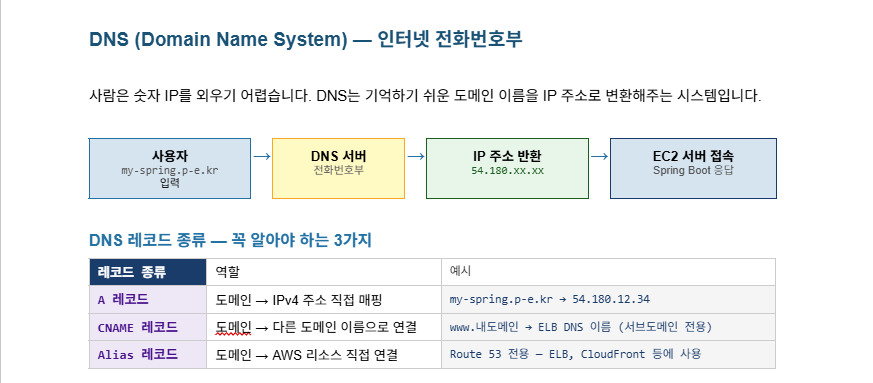
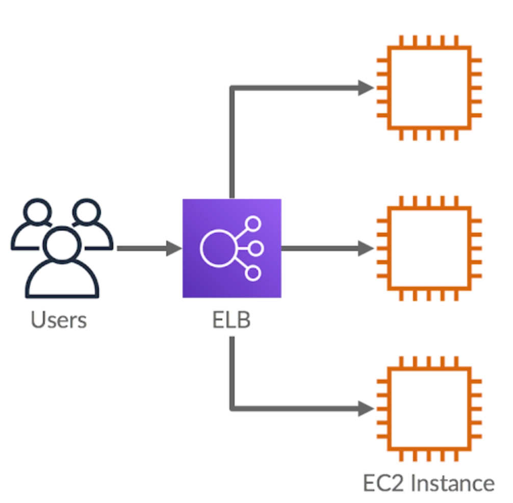

# 입실 체크 해주세요 !! ⏱️

# 복습 과정
1. EC2 만든다
2. key pair 및 security group을 적절하게 설정한다(application.yml을 8080으로 하고 싶으면 보안 규칙이 다르게 설정되어야겠네요)
3. EC2에 Java 설치하고 default springboot 프로젝트를 clone한다
4. application.yml 파일을 만들고 server와 port를 적절하게 설정한다.
5. 빌드 한다.
6. 실행한다. -> 되는지 체크
7. 탄력적 IP를 연결하고 발급받은 탄력적 IP로 백엔드 서버를 들어갔을 때 white label page가 뜨는지 체크한다.
8. 검사 받는다
9. 안전하게 삭제한다.

- 그리고보니까 IP주소로 들어가는게 불편해서 영어 주소값 있으면 좋겠다 -> domain 개념으로 연결됩니다.
- 백엔드 서버만 있고 DB는 로컬에서 돌려야 하나요? -> RDS 서비스 사용

# 본시 수업 - Domain 개념
## 현재 수업 상황에서 복습에서 삭제하라고 했던 EC2 다시 살려서 탄력적 IP 연결까지 완료했습니다(흐름을 다르게 가져갔었습니다).

## 필수 개념 수업
### 도메인(Domain)
naver.com / youtube.com과 같이 **문자로 만들어진 컴퓨터 주소** 를 의미합니다. 저희 IP 개념을 배웠으니까, IP도 컴퓨터 주소였지만 걔는 숫자로 이루어진거고, 얘는 문자열을 만든 다음에 저희 IP 주소와 매핑을 시켰다고 볼 수 있겠네요.

1. 서브 도메인(Sub Domain)
방금 naver 기준으로 확인했듯이 naver.com 도 있고 map.naver.com / search.naver.com 과 같은 주소를 확인할 수 있습니다. 즉, `_.naver.com` 형태의 도메인을 서브 도메인이라고 칭합니다. 그리고 그 정의는 **하나의 도메인 _아래_ 에서 여러 서비스를 구분하여 관리** 할 때 사용합니다. 서브 도메인들은 각각 따로 구매하는 것이 아니라 naver.com 하나 구매하면 모든 서브 도메인이 이용 가능합니다.

- 실무에서의 서브도메인 활용 방안
    - 서브 도메인은 메인 웹 사이트, 관리자 웹 사이트, 백엔드 서버 등의 구성 요소를 구분하기 위해 활용하는 편입니다. 예를 들어 maybeags.kr이라고 하는 도메인을 구매했다고 가정했을 때, 메인 웹 사이트는 maybeags.kr이고, 관리자용 웹 사이트 도메인으로 admin.maybeags.kr이고, 백엔드 서버의 도메인으로는 api.maybeags.kr이 되는 방식이겠습니다.

### 웹 서비스에 도메인을 적용하는 이유
웹 사이트는 데이터를 받아오기 위해 백엔드의 api와 통신하는 경우가 많습니다. 그러면 EC2로 올리는 것까지 배웠으니까 그냥 탄력적 ip로 받아오면 되지 않나 라고 생각할 수 있습니다. 근데 실무에서는 대부분 도메인 주소로 연결해줍니다.
일단 기억하기 쉽다. 더 중요한 실무적인 이유로는 HTTPS 적용을 하기 위해서입니다. 일반적인 IP 주소로는 HTTPS를 적용할 수 없으므로 실무에서 서비스 운영할 때는 도메인 적용이 사실상 필수적입니다.

### DNS(Domain Name System)
**도메인 주소를 IP 주소로 변환하는 시스템** : 사람은 문자열주소값을 더 잘 외울 것이고, 컴퓨터는 IP 주소를 더 잘 처리할거니까 중간에 변환해주는 체계를 만들자 -> DNS입니다.

1. DNS 레코드

https://내도메인.한국

https://cloud-information.tistory.com/11

이상의 사이트로 접속하여 내도메인.한국 signup하겠습니다.

- 내도메인.한국의 경우 서브도메인에다가 A 레코드를 적용할 수 있었기 때문에 백엔드 서버에 api 서브도메인을 달아줬습니다.

## ELB 이해하기
### HTTP vs. HTTPS
저희가 RESTful API에서 공부했던 것처럼 대부분의 웹 사이트는 HyperText Transfer Protocol이라는 방식으로 서버와 데이터를 주고 받습니다(그리고 그 중개 역할을 하는 데이터 폼이 JSON이었구요). HTTP는 주고 받는 데이터를 암호화하지 않기 때문에 중간에 데이터를 가로채는게 가능했습니다. 예를 들어 로그인하려고 했을 때 아이디와 비밀번호를 백엔드 서버로 보내게될텐데, 해커가 이를 가로채는 게 가능했겠네요. 우리는 암호화를 백엔드에서 DB로 보낼 때만 했었으니까요.

이상의 보안 문제를 해결하기 위해 개발된 것이 HTTPS입니다(Secure).

### HTTPS 적용 이유
1. 보안강화 : HTTPS 적용을 하면 데이터를 암호화해서 통신하기 때문에 추가 작업이 필요합니다. 백엔드 서버의 주소도 HTTPS 인증을 받아야겠네요. 따라서 데이터를 안전하게 주고받을 수 있도록 FE-BE 서버 모두 HTTPS를 적용합니다.
2. SEO(Search Engine Optimization) : 구글이나 네이버 같은 검색 엔진에서 HTTPS 적용하면 상위 노출 점수를 좀 더 줍니다.
3. 사용자 이탈 방지 : 이거 주소창 좌측 보시면 https 적용 안되어있으면 크롬에서 warn 띄웁니다. 신경 쓰시는 분도 있고 아닌 분도 있습니다.

### ELB(Elsatic Load Balancing)
AWS에서 제공하는 로드 밸런서 서비스를 의미합니다. 그러면 로드 밸런서가 뭐냐면 트래픽을 여러 서버에 걸쳐 분산하는 장치로, 특정 서버에 트래픽이 집중되는 것을 방지하고, 장애가 발생하더라도 정상적인 서버로 트래픽을 전달할 수 있도록 합니다. 즉, 같은 역할을 하는 서버를 2 대 이상 복수로 운영하는 경우 안정된 서비스를 제공하기 위해 ELB를 도입합니다.
또한 ELB에서는 특정 포트에서 HTTPS 요청을 처리하도록 설정할 수 있으므로 보안이 필요한 웹사이트나 API 서버에서도 많이 사용하게 됩니다(그래서 HTTPS 배우면서 ELB가 단원으로 함께 구성했었습니다).

### ELB의 구성 요소
1. 리스너(listener) : ELB로 들어오는 요청을 어떻게 처리할지 결정하는 규칙. 특정 포트와 프로토콜을 이용하여 클라이언트의 요청을 기다리고, 해당 요청을 ELB에서 설정된 규칙에 따라 적절한 _대상 그룹_ 으로 전달해줍니다. 예를 들어서 HTTPS 프로토콜을 사용하는 리스너는 443 포트에서 보안 연결을 통해 들어오는 트래픽을 받아서 암호화된 상태로 처리해줍니다. 리스너를 잘못 설정하면 요청을 올바른 대상 그룹으로 전달하지 못하므로 리스너 설정에 주의를 해줘야 합니다.

2. 대상 그룹(target group) : ELB가 수신한 트래픽을 전달할 서버들의 집합을 의미합니다. 즉 ELB로 들어온 요청을 어디로 보낼지 결정해야 하는데, 그 어떤 곳들을 대상 그룹이라고 볼 수 있겠습니다. 즉 ELB에 EC2 인스턴스를 추가한다면 ELB는 들어온 요청을 EC2 인스턴스로 전달해주게 됩니다. 근데 EC2에 오류 발생해서 서버가 멈췄다고 가정해보겠습니다. 그러면 보내봤자 쓸모 없을거기 때문에 ELB는 대상 그룹 내에 있는 EC2 인스턴스들이 살아있는지 확인하기 위해 주기적으로 요청을 보내봅니다. 그 때 200OK가 리턴되면 살아있다고 보고 요청을 해당 인스턴스에 보내게 되고, 만약에 200 OK가 리턴되지 않는다면 그 인스턴스에는 요청을 보내지 않는 **상태검사(health check)**도 수행해주는 기능이 있습니다. 대상 그룹을 만들 때 상태 검사를 할 경로와 포트를 지정해줍니다.

ELB 개념 이미지

