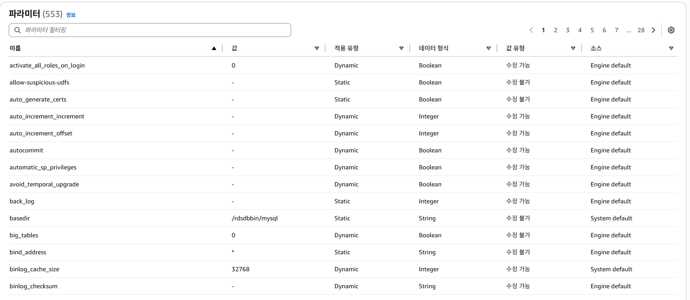
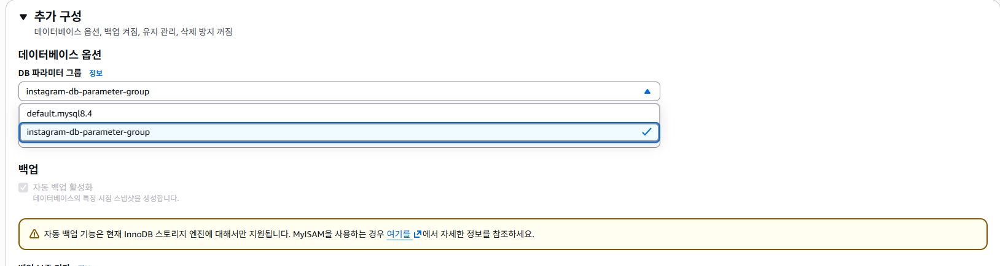

# 입실 체크 해주세요 !! ⏱️

# 복습 내용
1. EC2 인스턴스 생성
  - Java 설치
  - SpringBoot Project를 clone
  - Nginx 설치
  - Certbot 설치
2. 탄력적 IP 발행
  - EC2 인스턴스와 연결
3. 도메인 발급
  - 서브도메인과 탄력적 IP

Clone까지만 했을 경우 http로 접속이 가능
탄력적 IP 발급했을 경우 동일한 IP 주소로 접속 가능
도메인 발급하시면 문자열 주소값으로 접속 가능
Nginx - Certbot까지 적용하시면 https로 접속이 가능

# RDS 란 ?
## RDS
Relational Database Service의 축약어로 AWS 상에서 **관계형 데이터베이스를 빌려서 사용할 수 있는 서비스**. 내부에 MySQL / MariaDB도 있고, PostgreSQL 등 다양한 DB를 제공하며, 사용자가 원하는 유형을 선택해서 사용할 수 있습니다. DB를 안정적으로 유지보수할 수 있도록 백업 / 업데이트 / 자동 확장 기능을 제공해줍니다.

## RDS 인스턴스
AWS로부터 빌린 DB가 설치되어있는 컴퓨터 한 대를 RDS 인스턴스라고 합니다. EC2와 같습니다.
- 아니 우리는 localhost로 실행할 때 컴퓨터 한 대에서 backend 서버와 DB를 동시에 돌렸는데, 그 말은 EC2 내부에 DB를 설치해서 사용하는 방법이 있지 않을까요? -> 가능.
- 이유는 이하에서 설명하겠습니다.

RDS는 이하의 세 가지 옵션을 설정할 필요가 있습니다.
1. 엔진 유형 : DB 종류라고 생각하면 편합니다. 주요 데이터베이스의 엔진은 MySQL, MariaDB, Amazon Aurora 등.
2. 인스턴스 클래스 : 컴퓨터 성능을 의미합니다. 우리는 프리티어쓰겠지만 EC2에서의 인스턴스 유형과 유사한 의미.
3. 스토리지 : RDS 인스턴스도 컴퓨터이기 때문에 저장 공간이 존재합니다. EC2와 용어 동일.

## RDS를 사용하는 이유
1. EC2로 백엔드 배포를 하고, DB는 본인 컴퓨터에 설치해서 쓰는 방법도 가능.
2. EC2에 백엔드 및 DB를 배포하는 방법
  - 반드시 RDS를 활용할 필요는 없습니다. 토이 프로젝트의 경우에는 가능할 것 같습니다(대신 create-drop 해두면 더미 데이터를 미리 많이 CommandLineRunner를 통해 집어넣어둬야겠네요). 실무에서는 권장하지 않습니다. 만약에 백엔드 서버에 장애 발생 시에 EC2인스턴스에 이상이 생길 경우 DB도 영향을 받을 수 있기 때문입니다.

## 저희 RDS 적용 아키텍쳐 구성


## RDS 인스턴스 생성

- public access를 Yes로 잡았습니다. 개발 환경이나 로컬에서 RDS에 접근할 수 있도록 했습니다.
- 나머지는 free tier로 잡아놨고,
- 마스터 ID 및 패스워드 설정을 했습니다.

## RDS 보안그룹 설정
- EC2로 가서 보안그룹으로 들어갑니다.


## RDS Parameter group setting


1. 이하의 속성들 전부 utf8mb4 로 설정하기.
  - character_set_client
  - character_set_connection
  - character_set_database
  - character_set_filesystem
  - character_set_results
  - character_set_server
2. 이하의 속성들 전부 utf8mb4_unicode_ci 로 변경하기 - unicode_ci : 정렬 / 비교 방식을 명시
  - collation_connection
  - collation_server
3. time_zone 속성을 `Asia/Seoul`로 변경하시오.




- DB 파라미터 그룹을 변경한 후에는 RDS를 재부팅해야만 정상 적용이 됩니다(근데 우리 이거 생성하는데 시간 걸렸기 때문에 빠르게 나갔습니다).

## RDS로 접속하기
- 여러분 컴퓨터에 DBeaver 설치 여부 확인 -> 안되어있으면 설치하겠습니다.
- SQL 학습할 때 있었으니까 SQL repository 내에 있겠네요.

- instagram-db 인스턴스로 들어가서 연결 부분을 엔드포인트로 지정했습니다.
- dbeaver 켠 다음에 데이터베이스 연결 -> MySQL 선택 후에 server name에 aws의 엔드포인트를 붙여넣었고, username / password를 인스턴스 설정 시 만들었던 master id 와 master password를 입력했습니다.

- 그러니까 public key 요구가 있었습니다. 이하는 그 해결 방법입니다.
```
해결 방법: 연결 속성 수정
DBeaver 좌측 상단의 'Database Navigator'에서 해당 데이터베이스 연결 아이콘에 마우스 오른쪽 클릭을 합니다.
편집(Edit Connection) 또는 설정 메뉴를 선택하세요.
설정 창이 뜨면 [Driver properties] (드라이버 속성) 탭으로 이동합니다.
리스트에서 다음 두 항목을 찾아 값을 변경해 주세요. (우측 상단의 검색창을 이용하면 편합니다.)
allowPublicKeyRetrieval: 이 항목의 값을 false에서 **true**로 변경합니다.
```