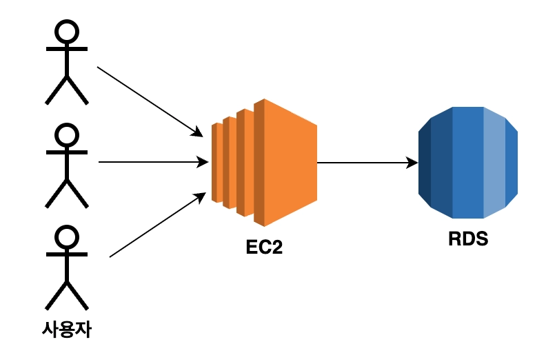
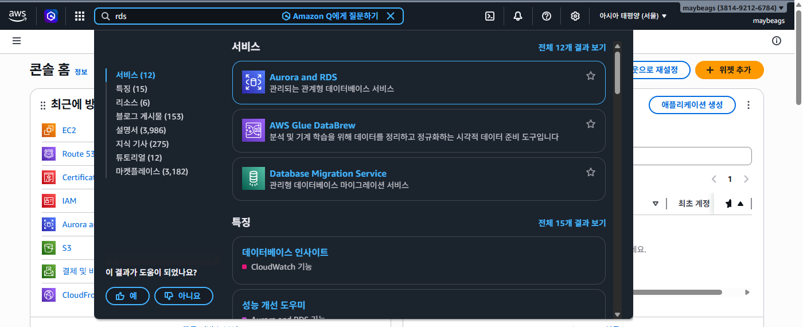

# 입실 체크 해주세요 !! ⏱️

# 복습 내용
1. EC2 인스턴스 생성
  - Java 설치
  - SpringBoot Project를 clone
  - Nginx 설치
  - Certbot 설치
2. 탄력적 IP 발행
  - EC2 인스턴스와 연결
3. 도메인 발급
  - 서브도메인과 탄력적 IP

Clone까지만 했을 경우 http로 접속이 가능
탄력적 IP 발급했을 경우 동일한 IP 주소로 접속 가능
도메인 발급하시면 문자열 주소값으로 접속 가능
Nginx - Certbot까지 적용하시면 https로 접속이 가능

# RDS 란 ?
## RDS
Relational Database Service의 축약어로 AWS 상에서 **관계형 데이터베이스를 빌려서 사용할 수 있는 서비스**. 내부에 MySQL / MariaDB도 있고, PostgreSQL 등 다양한 DB를 제공하며, 사용자가 원하는 유형을 선택해서 사용할 수 있습니다. DB를 안정적으로 유지보수할 수 있도록 백업 / 업데이트 / 자동 확장 기능을 제공해줍니다.

## RDS 인스턴스
AWS로부터 빌린 DB가 설치되어있는 컴퓨터 한 대를 RDS 인스턴스라고 합니다. EC2와 같습니다.
- 아니 우리는 localhost로 실행할 때 컴퓨터 한 대에서 backend 서버와 DB를 동시에 돌렸는데, 그 말은 EC2 내부에 DB를 설치해서 사용하는 방법이 있지 않을까요? -> 가능.
- 이유는 이하에서 설명하겠습니다.

RDS는 이하의 세 가지 옵션을 설정할 필요가 있습니다.
1. 엔진 유형 : DB 종류라고 생각하면 편합니다. 주요 데이터베이스의 엔진은 MySQL, MariaDB, Amazon Aurora 등.
2. 인스턴스 클래스 : 컴퓨터 성능을 의미합니다. 우리는 프리티어쓰겠지만 EC2에서의 인스턴스 유형과 유사한 의미.
3. 스토리지 : RDS 인스턴스도 컴퓨터이기 때문에 저장 공간이 존재합니다. EC2와 용어 동일.

## RDS를 사용하는 이유
1. EC2로 백엔드 배포를 하고, DB는 본인 컴퓨터에 설치해서 쓰는 방법도 가능.
2. EC2에 백엔드 및 DB를 배포하는 방법
  - 반드시 RDS를 활용할 필요는 없습니다. 토이 프로젝트의 경우에는 가능할 것 같습니다(대신 create-drop 해두면 더미 데이터를 미리 많이 CommandLineRunner를 통해 집어넣어둬야겠네요). 실무에서는 권장하지 않습니다. 만약에 백엔드 서버에 장애 발생 시에 EC2인스턴스에 이상이 생길 경우 DB도 영향을 받을 수 있기 때문입니다.

## 저희 RDS 적용 아키텍쳐 구성

## RDS 인스턴스 생성

- public access를 Yes로 잡았습니다. 개발 환경이나 로컬에서 RDS에 접근할 수 있도록 했습니다.
- 나머지는 free tier로 잡아놨고,
- 마스터 ID 및 패스워드 설정을 했습니다.

## RDS 보안그룹 설정
- EC2로 가서 보안그룹으로 들어갑니다.
